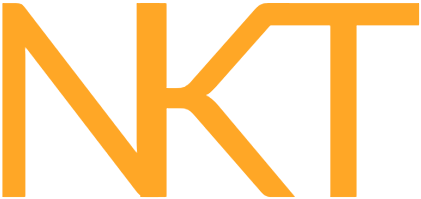

 

 
    
    
    
    
    

# About Knockt

Knockt is an API that simulates the processes of vending machine management.

This purely exists to demonstrate the features of Laravel out of the box and to be used as a teaching tool for members of my workplace team. Feel free to take and adapt this as much as you want.

As this project continues to grow and be worked on I will update this README endpoint information etc however if I find that it gets too cluttered, I may move it off to another more dedicated site.

-   [Vending Machines](#vending-machines)
-   [Machine Rows](#rows)
-   [Row Slots](#row-slots)
-   [Slot Product](#slots)
-   [Product Stock](#product)

## Developement Notes

I attempt to keep to Laravel as much as is possible while designing an API. I have changed very little base Laravel code and tried to utilise all features as much as possible (without bloating it for the sake of using feautes).

One of the only changes I've made is extending `\Illuminate\Foundation\Http\FormRequest` with `\App\Common\API\KnocktFormRequest` and overriding the `failedValidation` to always return a JSON error bag regardless of incoming request type.

I'm also following the [Microsoft API Best Practices](https://docs.microsoft.com/en-us/azure/architecture/best-practices/api-design) document as much as possible as I believe it to be one of the clearest design methodologies for API response structure.

## Vending Machines

-   Has many Rows
-   Has an Active State

## Rows

-   Belongs to a Machine
-   Has many Slots

## Slots

-   Belongs to a Row
-   Has a Product

## Product

-   Belongs to many Slots
-   Contains a running stock amount
