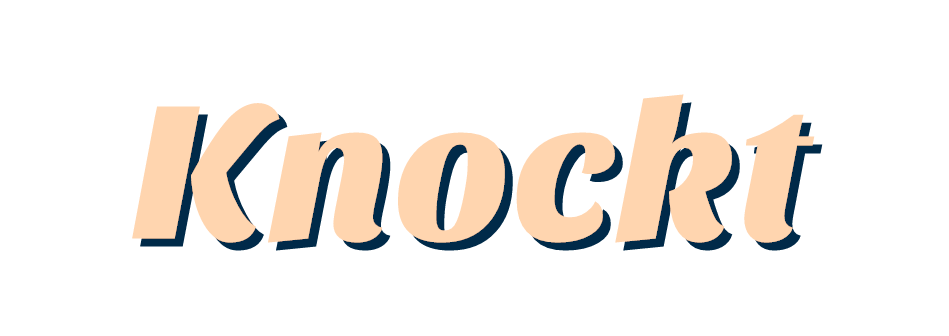

 

    
    
    
    

## Table of contents

-   [About Knockt](#about-knockt)
-   [Development Notes](#development-notes)
-   [Getting Setup](#getting-setup)
    -   [Prerequisites](#prerequisites)
    -   [Local Environment](#local-environment)
    -   [Required Reading?!](#required-reading?!)
-   [Endpoint Documentation](#endpoint-documentation)
    -   [Rows](#rows)
    -   [Slots](#slots)
    -   [Products](#products)

# About Knockt

Knockt is an example Laravel API implementation that translates the proceses of a Vending machine into a theoretical API.

Developed originally to teach junior PHP developers how to utilise Laravel, it's now a lightweight showcase of common features people can often see as ✨*magic*✨.

As this project continues to grow and be worked on I will update this README with endpoint information etc however if I find that it gets too cluttered, I may move it off to another more dedicated site.

> Interested in some front end concept designs? Check out my login form concept for this project on [CodePen](https://codepen.io/joebocock/pen/NWNMzgP)!

## Developement Notes

Using [Microsoft API Best Practices](https://docs.microsoft.com/en-us/azure/architecture/best-practices/api-design) and common web design methods, this is designed to be as standard as possible with very little deviation. This defines our base response structure, HTTP codes and request handling practices.

The only way that base Laravel functionality has been modified is through the use of renderable exceptions within `App\Exceptions\Handler`. If a model is not found, we instead return a more generic 404 response instead of specifiying the exact model that wasn't located.

## Getting Setup

### Prerequisites

Here's a quick fire list of steps to get started with the project locally. Please note this assumes that you have a basic understanding of development with PHP and have at least very basic knowledge of composer.

1.  Clone the repository.
2.  Run `composer install` within your working directory.
3.  Run `cp .env.example .env` within your working directory.
4.  Run `php artisan key:generate` within your working directory.

## Required Reading?!

If any of the above is confusing or you're not to sure what each command is doing, I'll provide a very simple explanation below along with a link to read more on the subject.

1. Here we are cloning the repository with a source control tool called **git**. If you're not sure what git it, I'd suggest reading up on that before trying to tackle this project. [Here's the offical git documenation](https://git-scm.com/doc), they have some great videos explaining the concept.
2. Composer is a PHP dependacy manager that handles a lot of tedious and often error prone work. [Here's the offical Composer documenation](https://getcomposer.org/).
3. Here we are simply copying an existing example configuration file. .ENV files often contain sensitive information for your application and as such, shouldn't be commited to version control. [Here's the github page for phpdotenv](https://github.com/vlucas/phpdotenv).
4. Finally, we are using a local tool called artisan to generate an application key. This is a Laravel specific step that allows our application to have a unique encryption key. [More can be found on this subject on the Laravel Documentation](https://laravel.com/docs/8.x/configuration#environment-configuration).

> Please Note! The default .ENV file provided with Knockt assumes you are going to use docker as your development environment.

### Local Environment

Thanks to Laravel and it's wide range of local tooling, we have quite a few options to get up and running.

Our application currently requires PHP 7.4 and MySQL 8 as it's core building blocks of infastructure. If you have the knowledge to locally configure Apache or Nginx and prefer to work that way, go ahead! Please note I won't provide any support for this local tooling however.

The main three development tools provided by Laravel out of the box are Sail, Valet and Homestead. But what are they?

New with Laravel 8, along came Sail! Laravel Sail is a nice docker wrapper configured to work perfectly with your Laravel projects out of the box. It is by far the easiest way to get up and running with a Laravel project and requires a user to have little to no experience with Docker itself (although I'd recommend reading into it as it's a very powerful tool). The only prerequisite here is having Docker itself installed on your machine and running.

Assuming you have Docker installed and running, simply run `./vendor/bin/sail up` within your working directory and visit http://knockt.test/. You should recieve a very simple JSON response of _404 Not Found_. Don't panic, this means it's working! For more in-depth knowledge on working with Sail and Docker see [here](https://laravel.com/docs/8.x/sail#introduction) and [here](https://docs.docker.com/).

As mentioned, Laravel also offers Valet and Homestead. Both of which require further configuration that is beyond this README. You can find the documentation for Valet [here](https://laravel.com/docs/8.x/valet#introduction) and Homestead [here](https://laravel.com/docs/8.x/homestead#introduction).

> Side Note: If you happen to be on Linux and want to use Valet, fear not! cpriego has created [Valet Linux](https://github.com/cpriego/valet-linux).

## Endpoint Documentation

### Machines

| Method | Path                 | Description                 |
| ------ | -------------------- | --------------------------- |
| GET    | `/api/machines`      | Lists all Machines          |
| POST   | `/api/machines`      | Store a new machine         |
| GET    | `/api/machines/{id}` | Retrieve a specific machine |
| PUT    | `/api/machines/{id}` | Update an existing machine  |
| DELETE | `/api/machines/{id}` | Remove an existing machine  |

### Rows

| Method | Path             | Description                           |
| ------ | ---------------- | ------------------------------------- |
| GET    | `/api/rows`      | Lists all Rows belonging to a machine |
| POST   | `/api/rows`      | Store a new Row                       |
| GET    | `/api/rows/{id}` | Retrieve a specific Row               |
| PUT    | `/api/rows/{id}` | Update an existing Row                |
| DELETE | `/api/rows/{id}` | Remove an existing Row                |

### Slots

| Method | Path                         | Description                          |
| ------ | ---------------------------- | ------------------------------------ |
| GET    | `/api/slots`                 | Lists all Slots belonging to a row   |
| POST   | `/api/slots`                 | Store a new Slot                     |
| GET    | `/api/slots/{id}`            | Retrieve a specific Slot             |
| PUT    | `/api/slots/{id}`            | Update an existing Slot              |
| DELETE | `/api/slots/{id}`            | Remove an existing Slot              |
| POST   | `/api/slots/{slot}/purchase` | Purchase the current Product in Slot |

### Products

| Method | Path                 | Description                 |
| ------ | -------------------- | --------------------------- |
| GET    | `/api/products`      | Lists all Products          |
| POST   | `/api/products`      | Store a new Product         |
| GET    | `/api/products/{id}` | Retrieve a specific Product |
| PUT    | `/api/products/{id}` | Update an existing Product  |
| DELETE | `/api/products/{id}` | Remove an existing Product  |
